##
系统使用说明书
#####
屈力 191870147

##开发环境：
*python*：3.8.1
*numpy*：1.22.3
*pillow*：8.3.2
*pyqt*：5.15.4
*Windows*：10.0.19044.1706

##功能说明

###命令行界面（CLI）程序：
首先在input.txt中编写好指令，然后运行cg\_cli.py程序（需要将input.txt和输出文件所在目录作为参数），若指令输入正确，程序将依次执行指令，输出bmp格式的图片（图片名为数字，按次序从1开始数起）

###用户交互界面（GUI）程序：
直接运行cg\_gui.py程序，将出现如下界面
<!-- 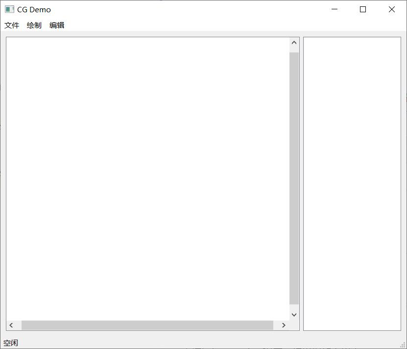 -->

####点击菜单栏的文件选项，出现以下子选项
<!-- 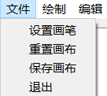 -->

#####设置画笔：设置画笔的颜色，有多种选择，也可以自己输入rgb值
<!-- 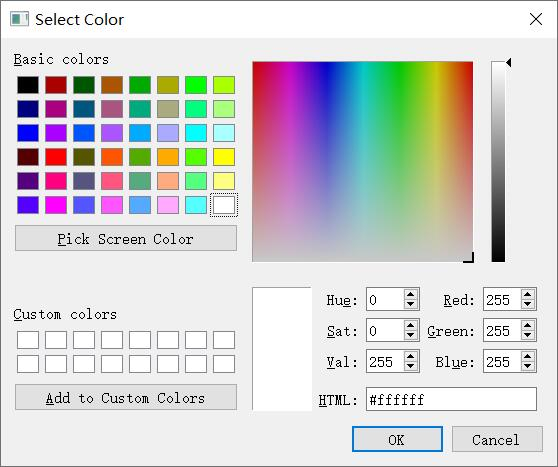 -->

#####重置画布：输入长和宽，画布将被清空，然后重新设置大小
<!-- 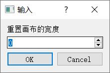 -->

#####保存画布：弹出路径选择窗口，选择保存路径，图片将保存为png格式
<!-- 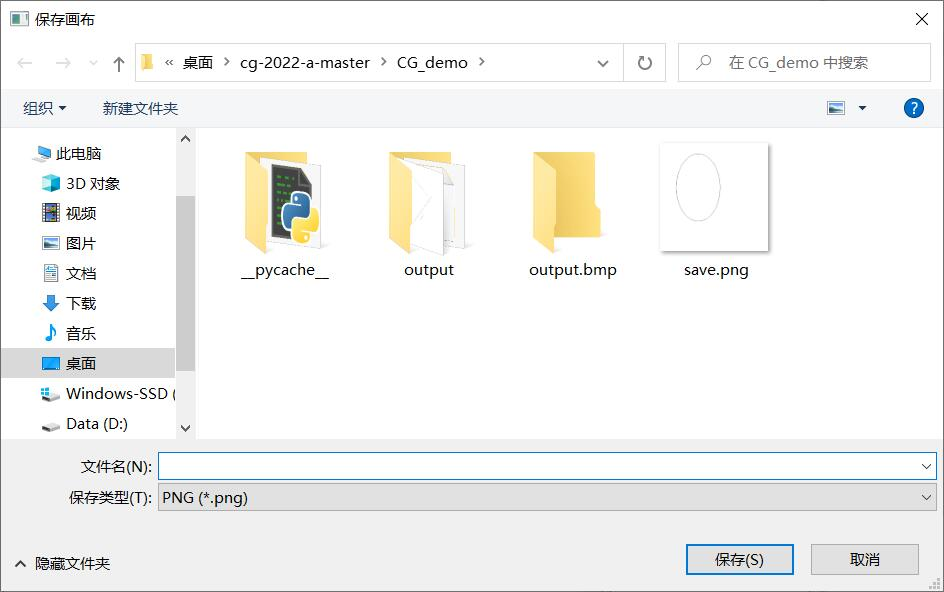 -->

####点击绘制栏，出现以下子选项：
<!-- 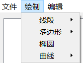 -->

#####线段：
从线段中随机选取一个算法，然后点击画布上的一点（线段起始端点），不松开左键的同时拖动鼠标可以随便选择线段的终结端点
<!-- 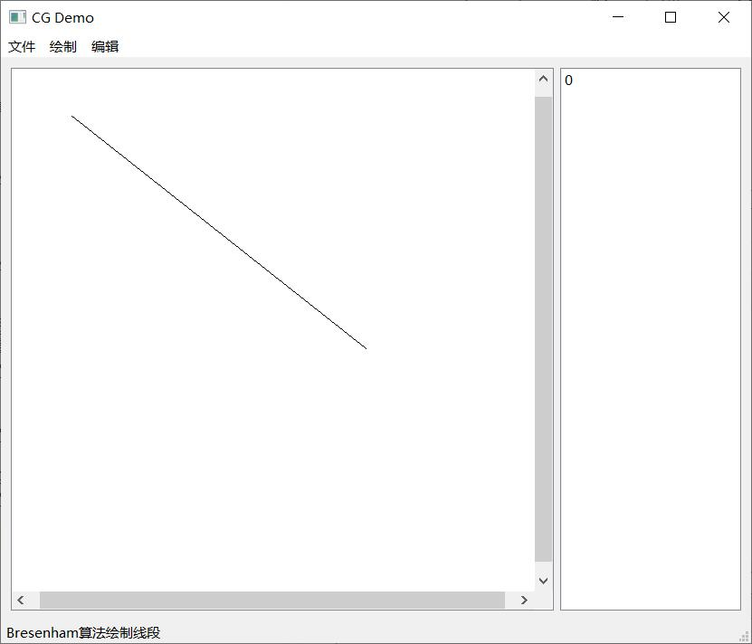 -->

#####多边形：
从多边形中随机选取一个算法，然后在画布上点击任意数目的点，将以这些端点绘制一个多边形
<!-- 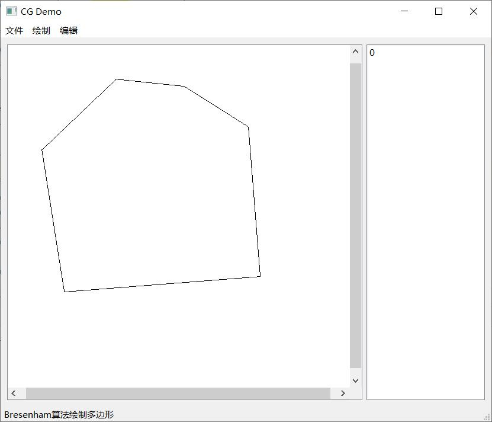 -->

#####椭圆：
点击椭圆，然后点击画布上的一点（椭圆外接矩形的左上角），不松开左键的同时拖动鼠标可以随便选择椭圆外接矩形的右下角，绘制任意大小位置的椭圆
<!-- 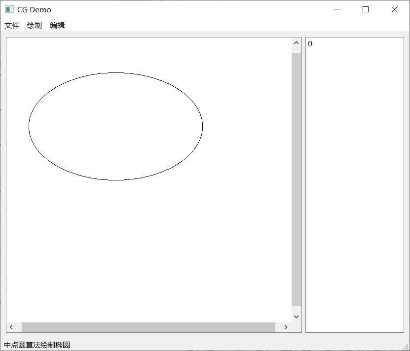 -->

#####曲线：
从曲线中随机选取一个算法，然后在画布上点击任意数目的点，将以这些点为控制点在对应算法下绘制一条连续曲线
<!-- 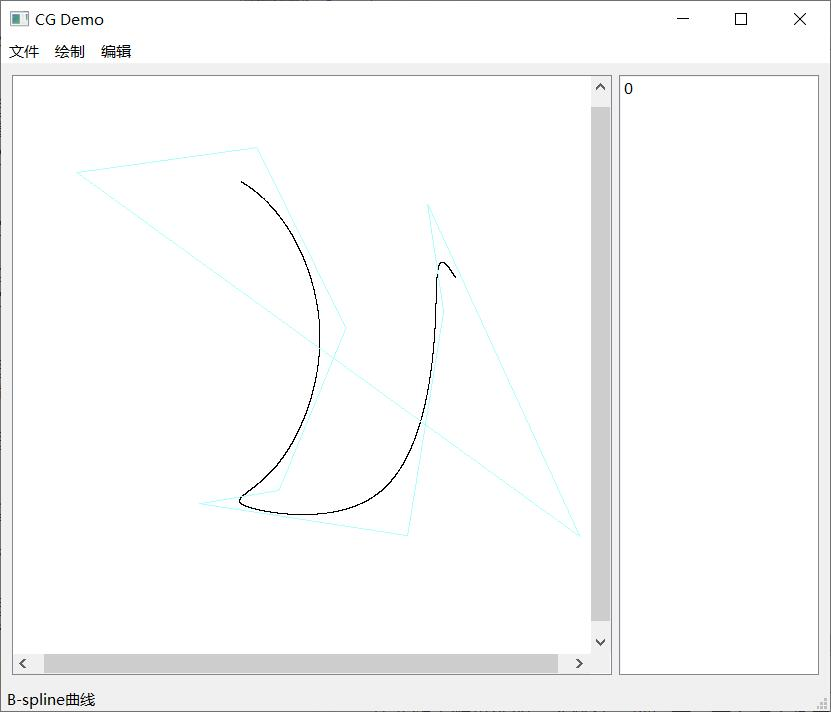 -->

####点击编辑栏，出现以下子选项：
<!-- 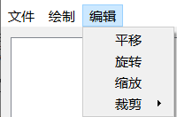 -->

#####平移
点击平移，然后在右侧选择一个图元，然后随便点击画布上的一点，不松开左键的同时拖动鼠标，可以根据鼠标移动的方向平移该图元
平移前

平移后

#####旋转
点击旋转，然后在右侧选择一个图元（只能是线段或多边形），然后点击画布上的一点作为旋转中心，再点击一个点，不松开左键的同时拖动鼠标可以围绕旋转中心根据鼠标的旋转方向旋转图形
旋转前

旋转后

#####缩放
点击缩放，然后在右侧选择一个图元，然后点击画布上的一点作为缩放中心，再点击一个点，不松开左键的同时拖动鼠标可以根据鼠标距离缩放中心的距离缩小或放大图形
缩放前

缩放后

#####裁剪
点击裁剪，然后在右侧选择一个图元（只能是线段），然后点击画布上的一点作为裁剪窗口的左上角，再点击一个点，不松开左键的同时拖动鼠标可以选择裁剪窗口的右下角，当松开左键时，会根据裁剪窗口对线段进行裁剪
裁剪前

裁剪后
